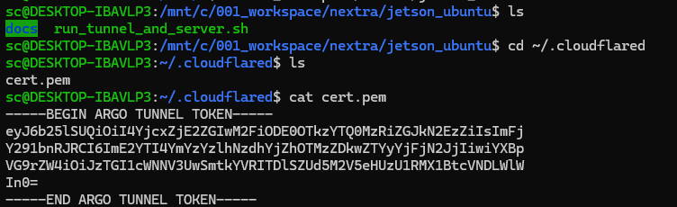
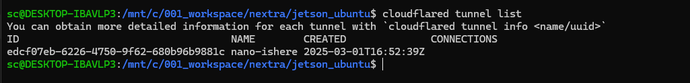
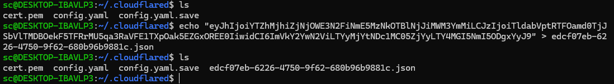

target id: edcf07eb-6226-4750-9f62-680b96b9881c.cfargotunnel.com.

## step 1
```
wget -O cloudflared.deb https://github.com/cloudflare/cloudflared/releases/latest/download/cloudflared-linux-amd64.deb

sudo dpkg -i cloudflared.deb (admin pass 250059)

cloudflared --version

(Login to Cloudflare)

cloudflared login

(This will open a browser. Log in and select the domain: ishere.help. A cert.pem will be saved to ~/.cloudflared.)

```



## create new tunnel
```
cloudflared tunnel create jetson
```
UUID.json
map the UUID to Cloudflare dashboard


## bind tunnel locally

mkdir -p ~/.cloudflared (Create tunnel directory if missing:)

cloudflared tunnel create --recover nano (nano is the name of tunnel)

when prompted:
edcf07eb-6226-4750-9f62-680b96b9881c



```
-a credential file in
home/sc/.cloudflared/edcf07eb-6226-4750-9f62-680b96b9881c.json

-tunnel config entry in
home/sc/.cloudflared/config.yml (sc is my WSL username)

```

## download token and save to .json



## update above config.yml

```
nano ~/.cloudflared/config.yaml

---

tunnel: edcf07eb-6226-4750-9f62-680b96b9881c
credentials-file: /home/sc/.cloudflared/edcf07eb-6226-4750-9f62-680b96b9881c.json

ingress:
  - hostname: nano.ishere.help
    service: http://localhost:8765
  - service: http_status:404

```

This also generates a credentials file in ~/.cloudflared.

## Step 2 Launch Tunnel + run Shell

run_tunnel_and_server.sh
```
#!/bin/bash

TUNNEL_NAME="nano"
DOCS_DIR="/mnt/c/001_workspace/nextra/jetson_ubuntu/docs"
SERVER_PORT=8765

echo "🚀 Starting Cloudflare Tunnel [$TUNNEL_NAME] ..."
cloudflared tunnel run "$TUNNEL_NAME" &
TUNNEL_PID=$!

echo "📂 Serving Python HTTP from: $DOCS_DIR on port $SERVER_PORT"
cd "$DOCS_DIR" || exit 1
python3 -m http.server $SERVER_PORT &

echo "✅ Both tunnel and HTTP server running."
echo "🌐 Access: https://nano.ishere.help/filelist.json"
echo "🔁 Press Ctrl+C to stop both"

wait $TUNNEL_PID
```


### Step 3

chmod +x run_tunnel_and_server.sh (make executable)
./run_tunnel_and_server.sh (run)
